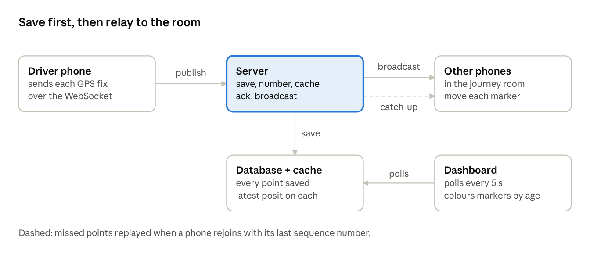

# How Live Journeys Are Relayed

Each phone sends its position to the server over a WebSocket. The server saves it, numbers it and forwards it to everyone else in the same journey. The dashboard reads the same positions by polling. That loop is the whole feature.



## 1. Everyone in a journey shares a room

- The phone opens one WebSocket to the server and sends its login token in the handshake. Reject a bad token before the connection opens.
- The phone sends `join-journey { journeyId, lastSequence }`. The server checks the user is a member, then adds the socket to the room `journey:<id>`.
- On join, the server sends the newcomer everyone's latest position, so the map is never empty.

## 2. A phone publishes its position

Every GPS fix becomes one small message:

```json
{ "journeyId": "…", "pointId": "uuid", "lat": -1.28, "lng": 36.82, "heading": 270, "speed": 13.2, "timestamp": 1790000000000 }
```

The phone generates `pointId`, so a point resent after a bad connection is never stored twice.

## 3. The server saves it, then relays it

For each message, in this order:

1. Check the journey is live and the sender is a member.
2. Save the point to the database. Skip it if that `pointId` already exists.
3. Give it the next number from a per-journey counter (a Redis `INCR`).
4. Overwrite the sender's latest position in a fast cache.
5. Ack the sender, so it can drop the point from its offline queue.
6. Broadcast `location-update { userId, lat, lng, heading, speed, timestamp, sequence }` to the room.

Saving before broadcasting means anything a phone was shown can always be fetched again.

## 4. The other phones draw it

Each phone keeps one marker per member and moves it on every `location-update`. It remembers the highest `sequence` it has applied, and ignores any update older than the position it already shows for that member.

## 5. Catching up after a phone sleeps

Phones lose their socket whenever the screen locks or the network changes, so the socket alone can't be trusted. Two things close the gap:

- **Rejoin with the last sequence.** The server replies with the points the phone missed (we cap it at 500), or tells it to fetch a snapshot if the gap is bigger.
- **Snapshot endpoint.** `GET /journeys/:id/live` returns every member's latest position, read from the cache with the database as fallback, plus the current sequence. Phones call it whenever the app resumes.

One rule: a snapshot never overwrites a newer position the socket already delivered.

## 6. The dashboard

The dashboard does not use the socket. Its server polls one endpoint every 5 s that returns the active journeys and each member's latest position from the same cache. Each marker is coloured by the age of its position:

| Marker | Rule |
| --- | --- |
| Live | Connected and under 30 s old |
| Stale | Reconnecting, or 30 s old or more |
| Offline | Disconnected, or 60 s old or more |

## What to build, in order

- [ ] WebSocket server with a token check and a room per journey
- [ ] Publish → save → number → cache → ack → broadcast
- [ ] Phone map that moves one marker per member
- [ ] Rejoin-with-sequence catch-up and the snapshot endpoint
- [ ] Dashboard polling the latest-positions endpoint

Rooms live in one server's memory. To run several servers, add a pub/sub adapter (for example Socket.IO's Redis adapter) so a point received on one server reaches sockets on the others.
